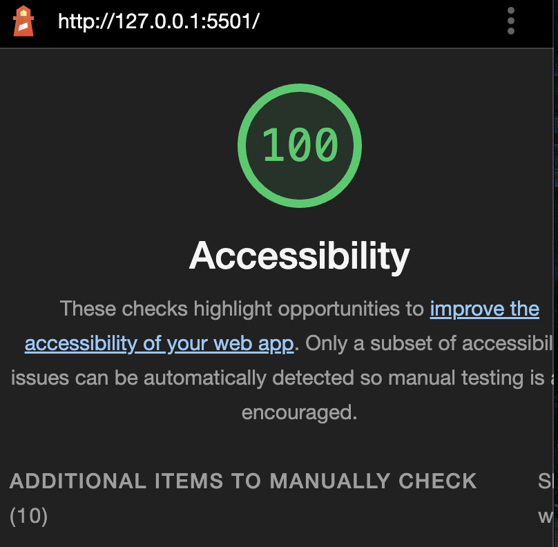

# odd-duck 

## Odd Duck

This is an application that generates three random images that a user can select from. Each selection is then recorded and reported to the user once they've selected all of the images.

### Author: Malik Sadiki-Torres

### Links and Resources

[w3schools](https://www.w3schools.com/)

### Lighthouse Accessibility Report Score

